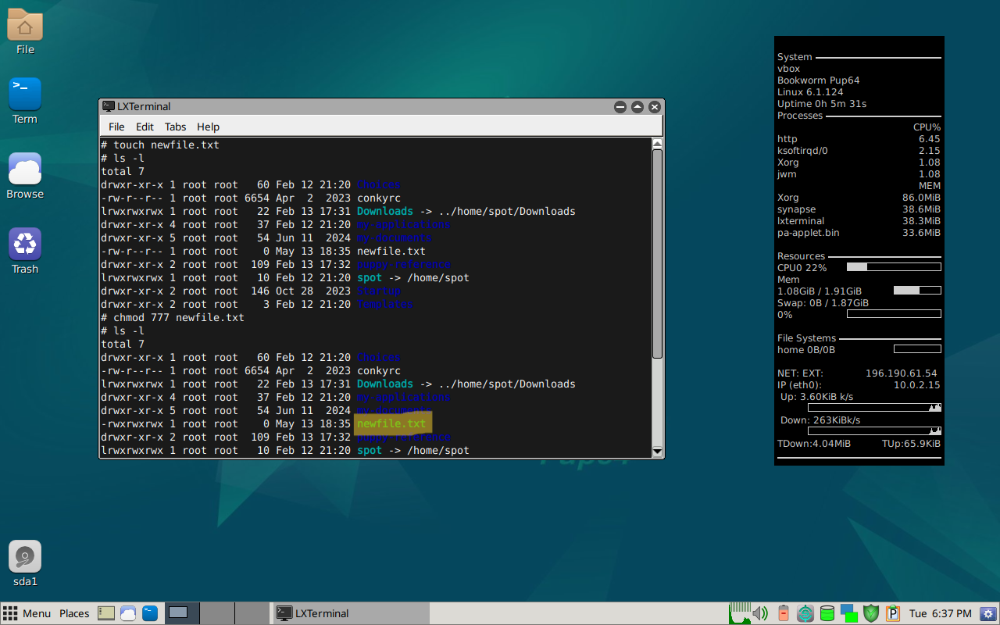
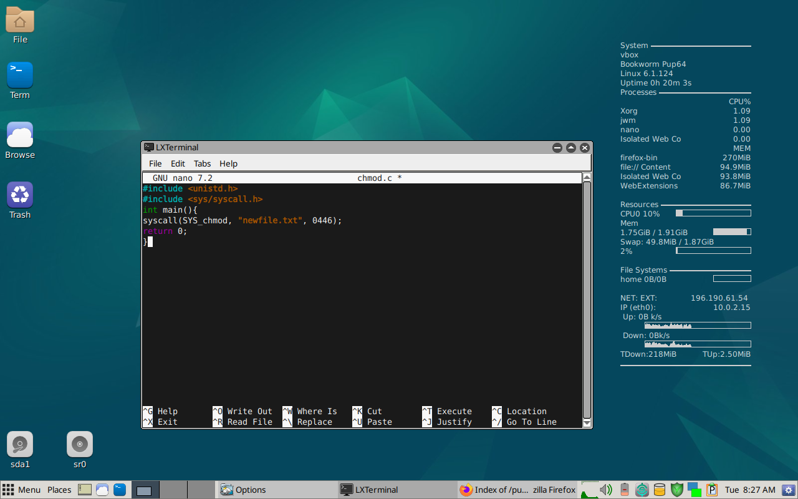
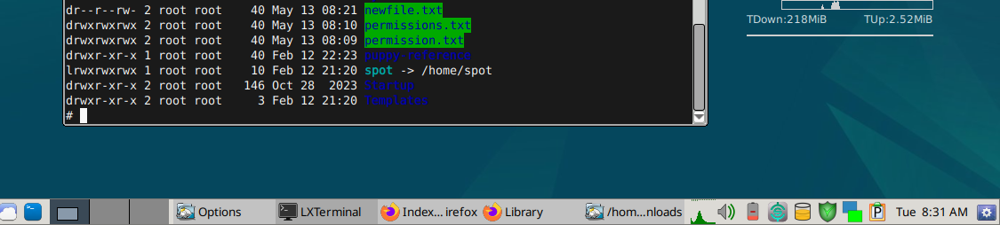

# Operating System Assignment

## A. OS Installation
This documentation explains how to install Puppy Linux using Oracle VirtualBox.  
It includes downloading VirtualBox, setting up a virtual machine, and attaching the Puppy Linux ISO.  
The installation process covers memory allocation, virtual disk setup, and solving live-mode issues.  
After installation, I tested persistence by saving files across sessions.  

Full installation steps with screenshots and explanations can be found in this PDF: [Download Puppy Linux Installation Report](puppy_Linux_Installation.pdf)

## B. System Call – chmod()

This demo shows how to use the `chmod()` system call in C to change file permissions.  
I created a file named `newfile.txt` and modified its permissions using the `SYS_chmod` syscall.  
The permission was changed from `0777` (full access) to `0446`, which gives read access to the owner and group, and write access to others.  
This demonstrates how system calls provide low-level control over file access in Linux.  
Screenshots are included to show terminal commands, the code, and the resulting permissions.

## 📸 Screenshots

1. Creating the file and applying `chmod`  
   

2. C code using `SYS_chmod` syscall  
   

3. Resulting file permissions  
   

